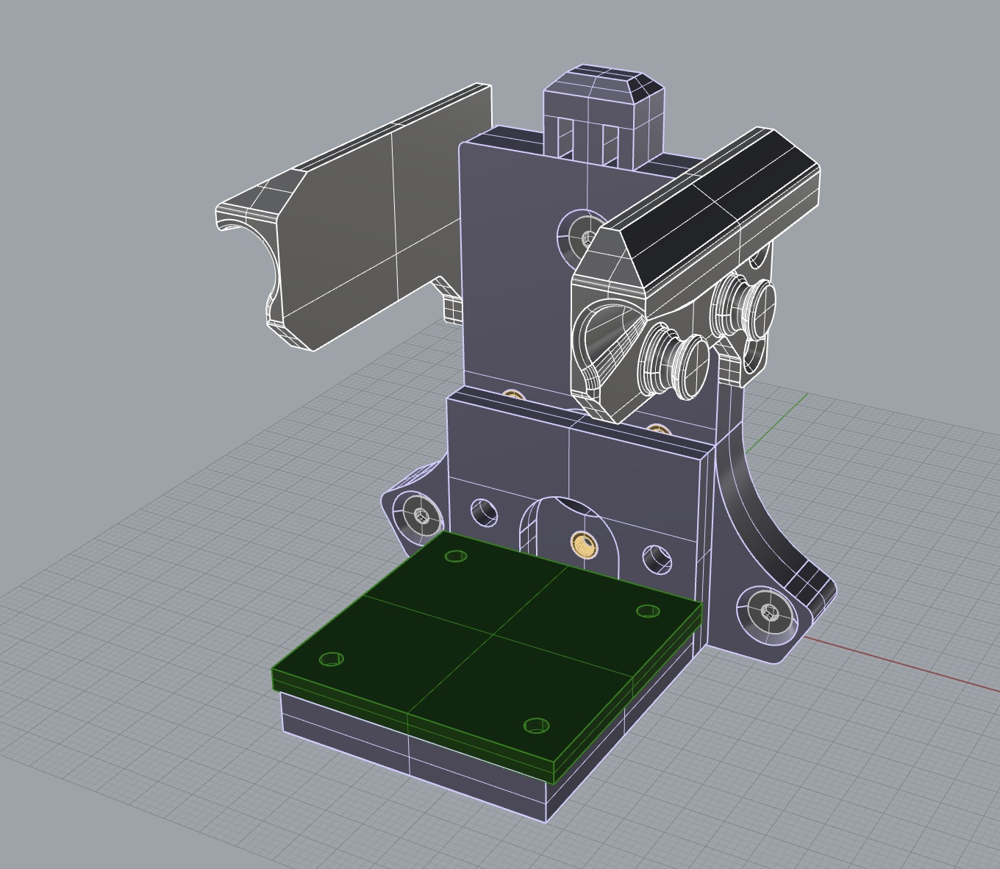
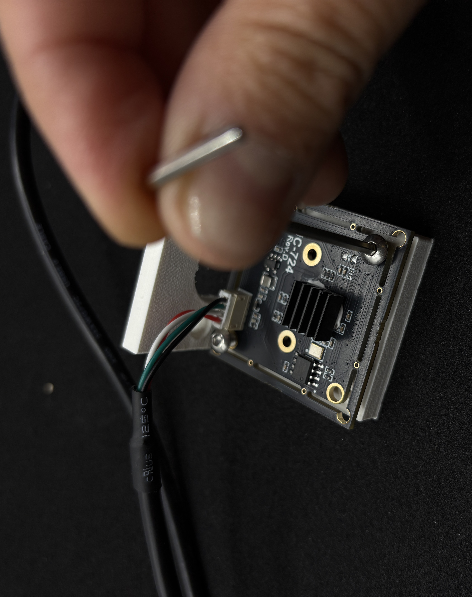

# Extending Science Jubilee

## Making a Toolhead

To create a custom tool that locks into Jubilee's carriage, you must position the tool balls and the wedge plate according to the [Tool Template Reference Dimensions PDF](https://docs.google.com/viewer?url=https://github.com/machineagency/jubilee/raw/main/tools/jubilee_tools/tool_template/references/tool_template_reference_dimensions.pdf). The easiest way to ensure proper placement is to build on top of an existing tool plate.

Below is an example of how we created the [webcam tool](/camera) used in this workshop:



The [base tool plate](empty_tool_base_plate.stp) and the camera adapter are secured together with four screws, allowing the base tool plate to be reused for different tools.

The camera sensor module is attached to the adapter with screws as well:  


You will also need compatible parking posts. Parking posts come in various sizes, defined by the distance between the two dowel pins. This base plate is designed to work with a 47mm parking post.

You can find the complete assembly [here](empty_tool.3dm).


## Extending an existing tool
If you want to add functionality to an existing tool, you can edit the associated tool module. You can find all the tool modules in the `science_jubilee/tools` folder ([here](https://github.com/machineagency/science-jubilee/tree/main/src/science_jubilee/tools)); on the provided workshop latops, the `science-jubilee` repository is installed alongside this `POSE25` directory.

## Adding a new tool
All tools inherit from the generic [Tool](https://github.com/machineagency/science-jubilee/blob/main/src/science_jubilee/tools/Tool.py) class. A new tool module might look like:

```python
# import the following from the Tool module
from science_jubilee.tools.Tool import (
    Tool,
    ToolConfigurationError,
    ToolStateError,
    requires_active_tool,
)

# Name your new tool here
class MyCoolNewTool(Tool):
    """A class representation of a syringe.

    :param Tool: The base tool class
    :type Tool: :class:`Tool`
    """
    def __init__(self, index, name, optional_additional_arguments): # you'll need an index and name
        """Constructor method"""
        super().__init__(index, name) # You'll always want to initialize the tool like this

        # Then you can set anything you need for your new tool, if relevant
        self.my_fancy_tool_stuff = "something"
    
    @requires_active_tool # if there are functions that require the tool to be equipped, use this decorator!
    def tool_functionality(self):
        """A function that can only be run when the tool is equipped"""
        return "stuff"
    
    def other_function(self):
        """A function that doesn't require the tool to be equipped"""
        return 

```

Take a look at some of the other tool modules for more references!
