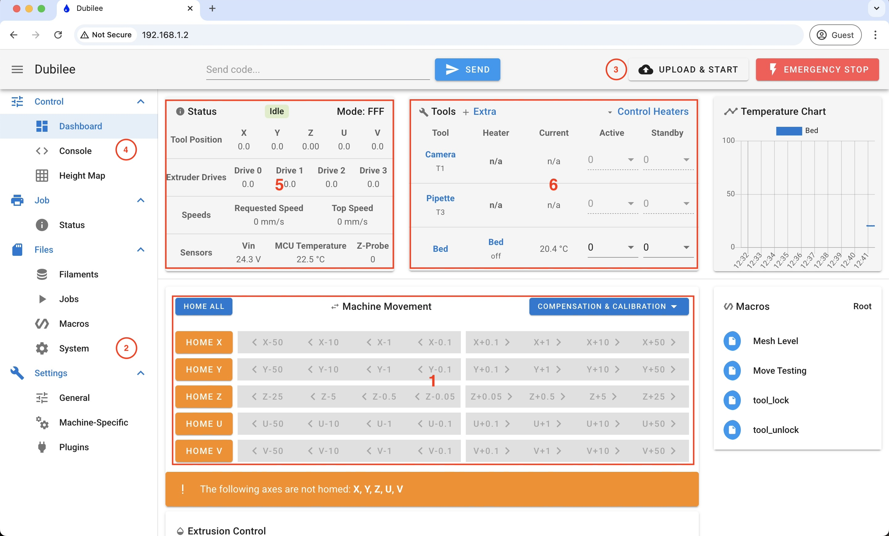

## Getting Started

In this folder, you'll find:

- **MachineJogging:** Instructions for connecting to the machine and moving it using Python code.
- **DuetIntro:** A guide on navigating the Duet Web Control interface.

### Duet Web Control Introduction

Duet Web Control (DWC) is a fully-featured, browser-based user interface for the Duet family of electronics running RepRapFirmware. Science-jubilee communicates with Duet boards via Ethernet and sends commands in G-Code. DWC provides a more direct control interface for Jubilee. It is commonly used to upload G-Code files for 3D printing, monitor printing progress, and more. Additionally, DWC can assist with the following tasks:

1. **Homing and Moving Axes**: Use the `Machine Movement` panel to home and move axes. This is similar to [how to jog the machine](../general/MachineJogging.ipynb), but DWC provides a graphical user interface.

2. **Editing Configuration Files**: Modify configuration files directly in DWC. This is useful for tasks such as [setting tool parking positions](../calibration/SetToolParkingPositions.ipynb).

3. **Uploading and Monitoring G-Code**: Upload G-Code files for 3D printing and track their progress. For an example and alternative printing methods, see the [gel printing notebook](../syringe/4_GelPrinting.ipynb).

4. **Viewing Error Messages**: DWC displays error messages in pop-ups that Science-jubilee cannot parse. Use the `Console` to view these messages and troubleshoot issues.

5. **Viewing Machine Status**: The `Status` panel shows the machine's current state, including tool positions. This information is helpful for tasks like [installing tool parking posts](../calibration/SetToolParkingPositions.ipynb).

6. **Managing Tools**: All tools defined in the configuration files are displayed in DWC. Their indices (`T{index}`) are important when defining and using tools in notebooks.
