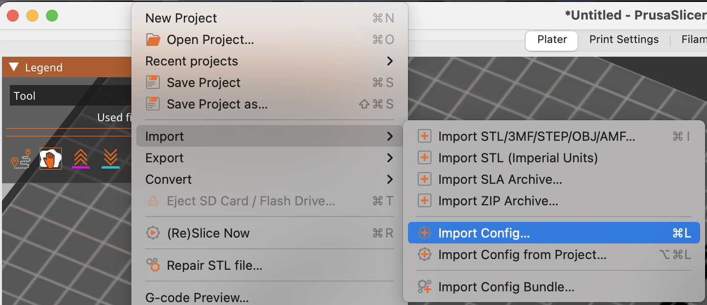
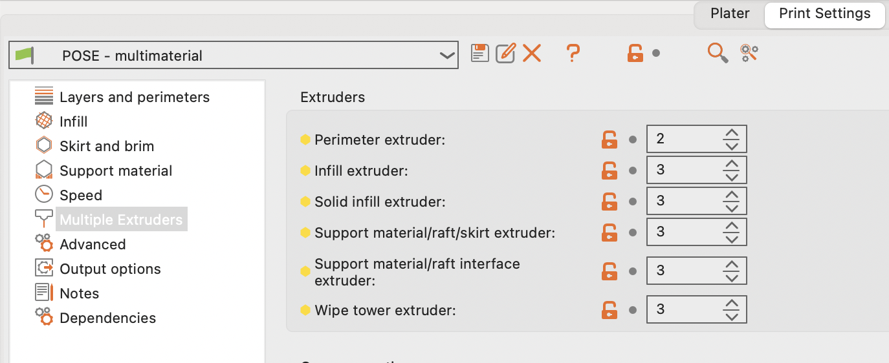
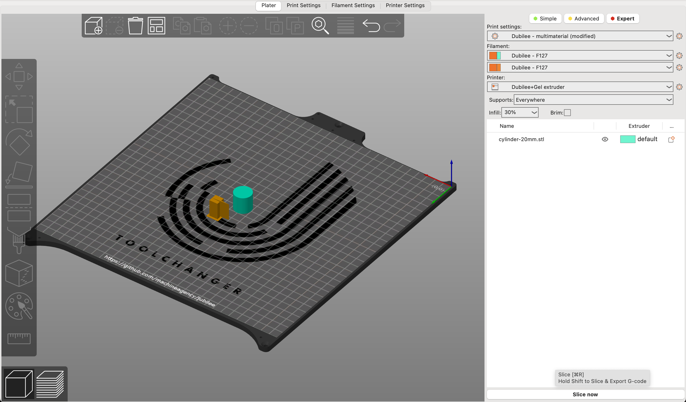

## Syringe

You can use the syringe tool for liquid handling or for gel 3D printing! If you want to print gels, feel free to skip over the liquid handling notebooks.

### Liquid Handling
- **0_Syringe:** An introduction to using the syringe tool for liquid handling.
- **1_SerialDilution:** Using a syringe to run a serial dilution.

### Gel Printing
**2_SyringExtruderIntro**: An introduction to using the syringe tool as a gel extruder
**3_GelPrinting**: Printing gel structures with F-127.

### More Gel Printing Info
If you want to use the syringe tool to print gels  while taking advantage of slicing software, here is a guide to using the Duet interface and PrusaSlicer to do so!

## Generate GCode using PrusaSlicer
Many slicers can be configured to work with Jubilee. Here, we use PrusaSlicer. The laptops provided in this workshop should have PrusaSlicer installed and configured. If you wish to have it on your own computer, you need to install the latest PrusaSlicer and import the config bundle `Jubilee_Prusa_config.ini`.

### Importing the Config
To import the config into PrusaSlicer, follow these steps:

1. Open PrusaSlicer.
2. Go to `File > Import > Import Config ...`.
3. Navigate to the location of the `Jubilee_Prusa_config.ini` file and select it.

This will load the configuration settings for the Jubilee printer into PrusaSlicer.

### Load and Slice the Model
After installing and configuring PrusaSlicer, you can load your 3D model into the software. To do this, click on the 'Add' button on the top and select your model file in `.stl`. Once the model is loaded, you can adjust its orientation and scale if necessary.

#### Printing and slicing parameters

We are printing with Pluronic F127 hydrogel (25 wt%). It is a gel at room temperature but liquifies at cooler temperature. The slicer bundle is set up to let you print with a 18 gauge nozzle (green). You can experiment with printing parameters to yield different results. The parameters and settings can be access by clicking on the gear icons on the right when you're inside of the `Plater` tab or by clicking on the corresponding tabs on top. When you are on any of the `Settings` tab, you can use `cmd + F` or `ctrl + F` to quickly locate a parameter.

**Nozzle diameter** allows you to use different size of nozzles to achieve different resolution. It is under `Printer Settings`. We provide a range of nozzle sizes and you can look at their `Needle Nominal ID` from [this chart](https://www.hamiltoncompany.com/laboratory-products/needles-knowledge/needle-gauge-chart).
If you change the nozzle diameter, you may also want to change your **Extrusion width** under `Print Settings > Advanced`. Again, you can quickly locate this setting by using the search hot key.

**Speed** under `Print Settings` is tied to the viscosity of the material. The default setting for F127 is 10 mm/s. If you chose to use a smaller nozzle, you may want to decrease the speed for print moves.

**Layer height/First layer height** under `Print Settings` affects your print quality and time. They should scale up and down with the nozzle size.

The rest is for you to explore!

You may note that this config has *FOUR* syringe extruders but there is only one on the machine. This is to allow the slicer to generate GCode with the correct tool number for Jubilee. Extruder assignment can be changed under `Print Settings > Multiple Extruders`. 

Note that e.g. Extruder 3 is Tool 2 on Jubilee since Jubilee tool index starts at 0 and PrusaSlicer counts from 1.

### Slice & Export
Once you are happy with all the settings, click `Slice now` on the bottom right corner to generate a preview. The preview displays visual information such as infill pattern and tool path if you wish to examine them. Remember to `Export G-code` to generate the GCode file.

## Send the GCode to the Printer
Once you have your GCode, you can send it to the Jubilee printer. To do this, use the Duet Web Control (DWC) interface to upload the GCode. A full manual about Duet Web Control can be found [here](https://docs.duet3d.com/User_manual/Reference/Duet_Web_Control_Manual).

With a tuned Jubilee, all you need to do is to upload the GCode file. Simply click `UPLOAD & START` on the top right corner in DWC. 

You can monitor the print to ensure that everything is going smoothly. If you notice any issues, you can pause or stop the print through the Duet interface.
